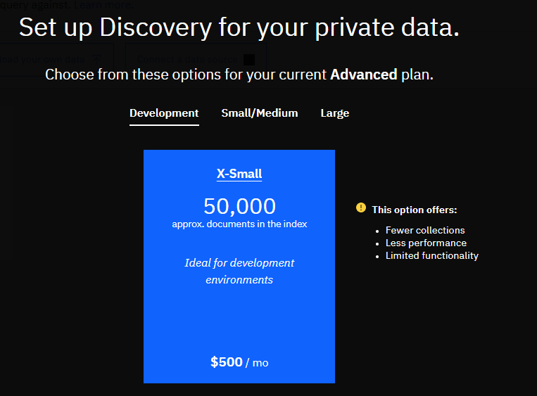

# Watson Discovery ハンズオン

## 概要

Watson Discoveryとは、大量のテキストデータを取り込んで「人が知りたいものを見つける・分析する」処理を行えるコグニティブサービスです。

イメージ的には全文検索エンジンに近いものですが、

- 自然言語での問い合わせ
- 機械学習によるタグ付けやメタデータ抽出のサポート

といった機能を持っています。


## お題

バックログの課題とコメントを学習してQ&Aサイトを構築します

## Discoveryインスタンスの作成

1. 上部メニューのカタログをクリックします
2. 左メニューの「サービス」から「AI」を選択し、「Discovery」をクリックします
3. インスタンス作成画面からインスタンスを作成します


- 地域は「東京」を選択します
- 料金プランはライト、もしくは拡張を選択します
  - ドキュメント数が1000件以内、かつ、Cloud内に1つしかインスタンスが必要ない場合はライトでOKです
  - ドキュメント数が1000件以上ある場合、もしくは、複数人で1つのサブスクリプション内でハンズオンを実施する場合は拡張を選択してください
    - この場合、インスタンスの使用料が発生する点に注意してください


- サービス名は区別の付く名前を付けてください
- リソースグループは予め作成しておいたグループを使用するか、可能ならdefaultのままでも問題ありません

1. 右側の「作成」ボタンを押下し、インスタンスを作成します
2. インスタンスが作成されるのを待ちます
  - 数分待つ必要があるので、その間に次のデータ準備に取り掛かります

## Backlogのエクスポート

Backlogの課題の検索結果からCSVエクスポートを実行します。

[参考](https://support-ja.backlog.com/hc/ja/articles/360035642534)

ダウンロードしたCSVを眺めてみましょう。  
どのような構造のデータが格納されていますか？

## データの事前準備

Discoveryは登録したドキュメントを自然言語で検索可能にするAIソリューションです。  
そのため、今回のようにすべてのデータが1つのCSVにまとまっていると期待する検索結果が得られません。

ここでは、CSVのヘッダを利用して構造化されたJSONを生成します。

- Windowsの場合、このドキュメントをチェックアウトしたルートディレクトリ上で以下のコマンドを実行します

```C:\path\to\document\root>powershell .\bin\csv-to-json.ps1 path\to\csv```

- 実行すると、workディレクトリが生成され、そのディレクトリ内にJSONファイルが生成されます

## 学習

インスタンスが出来たら、学習環境を作成していきます。

1. リソースリストから自分が作成したサービスを選択し、詳細画面を開きます
2. 「Watson Discoveryの起動」をクリックし、ツールを起動します


### 環境の作成

1. 右上のメニューからデータアイコンを選択し、「Create environment」をクリックします


2. そのままSetUpを実行します
  - 拡張プランの場合は環境サイズを選択する必要があるため、DevelopmentのX-Smallを選択してSetUpを実行します



### コレクションの作成

1. 「Upload your own data」をクリックします
2. 「Collection」名に「Backlog」と入力し、「language」に「Japanese」を選択してCreateをクリックします


### データのアップロード

1. アップロードアイコンをクリックし、先程生成したJSONをすべてアップロードします
2. 処理が完了するまで待ちます
   - 件数次第ですが数分はかかります

## テスト

1. 学習が完了すると、"ready to query!"という文言が表示されますので、「Build your own query」をクリックします


2. 「Search for documents」を展開し、Use natural languageに自然言語で問い合わせてみましょう
   - ex) 「データベースの負荷が高い」など

## API呼出

1. リソースリストから作成したDiscoveryインスタンスを選択し、資格情報に記載されたAPI鍵及びURLを確認します
2. ツールの「Manage data」からBacklogを開き、右上の「api」をクリックすると各種環境のIDが確認出来ます。
3. API鍵とURLなどからCurlリクエストを構築し、リクエストしてみましょう

```
curl -X GET -u "apikey":"xxxxxxxxxxxx" -H "Content-Type: application/json" "https://api.jp-tok.discovery.watson.cloud.ibm.com/v1/environments/${environmentId}/collections/${collectionId}/query?version=2019-04-30&query=test"
```

4. APIリファレンスを参考に高度な検索を試してみましょう

## 応用編

- 余裕があれば以下のような課題にもチャレンジしてみましょう

### 非構造化ドキュメントの扱い

今回のハンズオンで使用したデータはJSON化したため、すでに構造化されています。  
Discoveryの強みは構造化データに限らず、非構造化ドキュメントを取り込み、それに対するタグ付け、自動的な構造化のアシストといった機能を持っている点も挙げられます。

製品マニュアルや議事録、論文など、構造化されていないドキュメントに対してどんなことが出来るかチャレンジしてみましょう。

### API呼出

API

### ChatBotとの連携

自然言語での問い合わせが可能ということは、チャットボットとの相性がいいことを示唆しています。

チャットボットとAPI連携して、似たような課題を教えてくれるチャットボットを作成してみましょう。

### 追加・精度の改善

Discoveryにはまだまだ色々な機能があります。  
ドキュメントを読み込み。SDUやデータソースなどについて調べて活用ユースケースを検討してみましょう。

## 参考資料

- [公式ドキュメント：Discovery概要](https://cloud.ibm.com/docs/services/discovery?topic=discovery-getting-started)
- [公式ドキュメント：APIドキュメント](https://cloud.ibm.com/apidocs/discovery/discovery)
- [ブログ記事：IBMのAI文書検索システム「Watson Discovery」で何ができるの？](https://ai-products.net/7897/ai-document-search-system-watson-discovery/)
- [Qiita：Watson Discovery Serviceが日本語対応したので、触ってみた【何、それ？】編](https://qiita.com/ishida330/items/b823d7c5b55806f04242)
